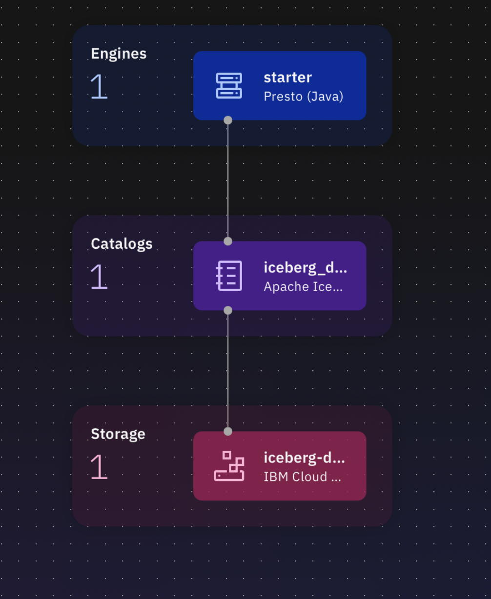
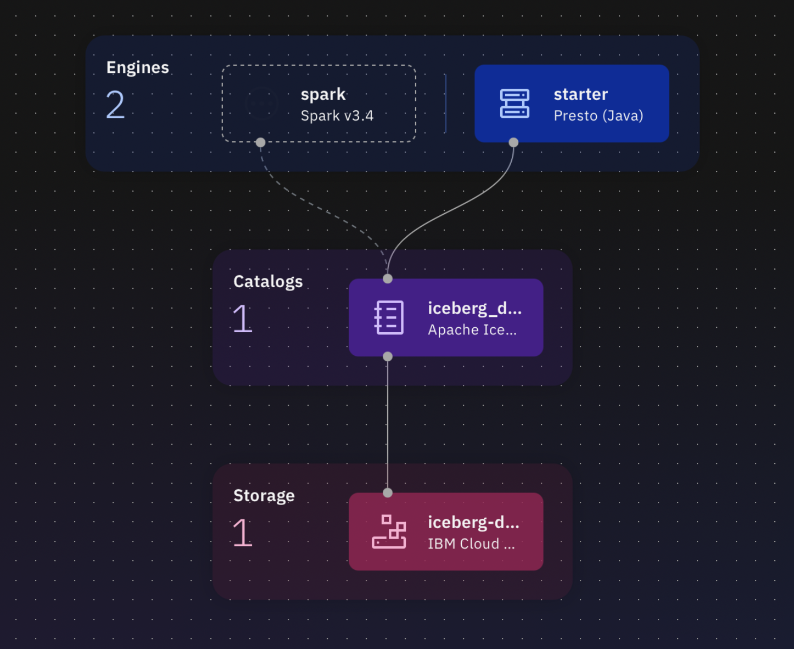
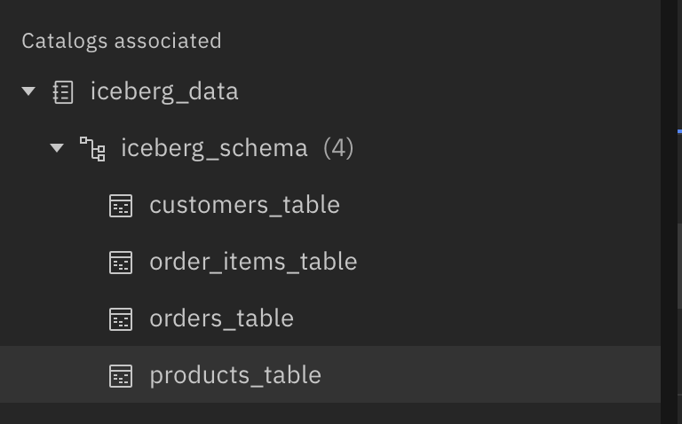

# watsonx-data-generic-setup

## Overview

1. Set up watsonx.data environment & COS (optional for data-dependent agents)
2. Ingest data (optional - skip if your agent doesn't need data)
3. Set up watsonx.ai
4. Create and deploy agent in watsonx.ai
5. Add agent to Orchestrate

### Example Data Tables (Optional)

If your agent needs to query data, you can set up tables like:
- Example table 1 from postgres_catalog
- Example table 2 (iceberg)
- Example table 3 from iceberg_data

### TechZone environment

Link: https://techzone.ibm.com/collection/67d1edfa2aa18c25d43edb04

## Step 1: Set up watsonx.data & COS (Optional)

**Note:** Skip this step if your agent doesn't need to access structured data sources. Jump directly to Step 3.

1. Use the above link to provision the correct environment. 
    - **Environment name:** "wx.data ONLY watsonx Data"
    - Note: This environment includes COS, wxO, and wx.data services in the same cloud account. 
2. Open watsonx.data and you will see required setup steps
3. Open COS in a new tab and create a new bucket called "your-bucket-name"
4. Create HMAC service credentials in COS
5. Go back to wx.data to do initial setup. When prompted, select "Register my own instance" for COS and input the required fields.
6. Test your connection and if it's successful, continue setup. In the next step, ensure you choose "Apache Iceberg" as your data lakehouse. You can use default settings for all remaining setup steps.
7. Wait for setup to finish (takes up to 15 minutes) and then check your Infrastructure Manager page. It should look like this:

8. Provision a Spark engine in wx.data (small is fine). Under "Associated Catalogs", check the box for "iceberg_data". Now your infrastructure should look like this:

## Step 2: Ingest Data using Spark (Optional)

**Note:** Skip this step if your agent doesn't need data ingestion.

Once your Spark engine provisions, you can ingest your datasets into the iceberg catalog.

1. Navigate to "Data manager" and click the 3 dots on the right of "iceberg_data" -> click "Create schema" -> name it "your_schema_name" -> Create
2. In "Data Manager" click the blue "Ingest data" button in the top right corner -> Add data from Local System
3. Drag and drop your data file (e.g., .parquet, .csv) then click "Next"
4. On the right side of the page, under "Target table", enter a name for the table such as "your_table_name"
   
   - **Note:** Please ensure you create a new table for each unique data file you ingest. All tables should be created under your schema.

5. Click "Preview" then "Ingest"
6. Repeat steps 2-5 for additional data files
    - **Please note:** Ingest files one at a time to create proper schemas and tables
7. Once you ingest all files, you should have the following structure for your schema and tables:

## Step 3: Set up watsonx.ai

**3.1 Set up project**
1. Create a new project in watsonx.ai
2. Associate a WML service with your project
3. Under "Manage" -> "Access Control" -> click on the tab called "Access tokens"
4. Add a new access token to project 
5. Give it a name, select Editor for Access Role and select Create

**3.2 Create user API key**
1. Go to Profile and settings for a given user (upper right corner with user initials) -> User API Key Tab
2. Click Create a key + if you do not have one.

**3.3 Create a deployment space**
1. Create a new deployment space
2. Fill in **Name**, select **Development** Deployment Stage, select **storage service** from drop down as well as **watsonx.ai Runtime**, then click Create

### Create Data Source Connections in the watsonx.ai Studio project (Optional)

**Note:** Only complete these steps if your agent needs to access external data sources.

**3.4 Add Data Connection (Example: Presto)**

1. From watsonx.ai Studio Project -> Assets -> New asset + -> Connect to a data source -> Search for your data source type -> Next
2. Fill in your connection details:
    - Rename the connection to something descriptive (e.g., "data_connection")
    - Paste the appropriate API Key
    - Test connection (upper right corner) and once successful, Create connection.

**3.5 Add Storage Connection (Example: COS)**

1. From watsonx.ai Studio Project -> Assets -> New asset + -> Connect to a data source -> Search for IBM Cloud Object Storage -> Select IBM Cloud Object Storage
2. Fill in your connection details:
    - Name: storage_connection
    - Leave Bucket name field empty
    - For Login URL, use Storage Public Endpoint without https://
    - Under Credentials, select Resource Instance ID and API Key
    - For Resource instance ID, enter Storage CRN
    - For API key, enter your Storage API Key

**3.6 Review connections in the project (Optional)**

Verify you have the necessary connections for your agent's requirements.

## Step 4: Create and Deploy Your Agent

**4.1 Prepare your agent code**
1. If using external connections, create an env.txt file with your configuration values
2. Add env.txt to your watsonx.ai project Assets (if needed)
3. Upload your agent notebook (e.g., GenericAgent_wxai.ipynb) to your project
4. Open the notebook
5. Insert a "Project token" in the first cell of the notebook
6. Update the agent code to match your specific use case:
   - Modify the tool function to perform your desired operations
   - Update the prompts and examples
   - Adjust model parameters if needed
7. Run all cells in the notebook to create the agent and deploy it
8. Return to these instructions once you have deployed the agent

**4.2 Get Streaming Endpoint for your Deployment**
1. In watsonx.ai, go to your deployment space -> click deployments -> click on the new deployment
2. Copy the **public streaming endpoint** and save it somewhere you can find it again

## Step 5: Add Agent to Orchestrate

**5.1 Create an agent in orchestrate**
1. Open watsonx orchestrate from cloud resources: https://cloud.ibm.com/resources
2. From the hamburger menu, go to Build, Agent Builder
3. Select Create Agent + button
    - Select Create from Scratch
    - Name your agent (e.g., "MyGenericAgent")
    - Under Description enter what your agent does (e.g., "This agent helps users by analyzing data and providing insights.")
    - Select Create button to create agent

**5.2 Configure the agent details**
1. Scroll down to the Toolset section on the left hand side
2. Click on Add agent under Agents
3. Select External agent and click Next.

**5.3 Configure import agent options**
1. Choose watsonx.ai as provider since your agent is deployed on the watsonx.ai platform
2. Add your Cloud API Key under API Key
3. Under Service instance URL paste the deployment endpoint you copied earlier
4. Under Display Name add a descriptive name for your agent
5. Under Description of agent capabilities add a description of what your agent can do
6. Select Import Agent to integrate the watsonx.ai agent.

The imported agent should now be listed in the agents section!

**5.4 Deploy Agent**
1. In the Preview section, enter a greeting to start a chat from the right side chat window.
2. Enter a test question relevant to your agent's capabilities
3. Click Deploy button from the top right corner, and Deploy to deploy the agent.

**5.5 Test Deployed Agent**
1. Under the hamburger menu, go to Chat and select your deployed agent from the Agents drop down
2. Interact with the Agent by asking different variations of questions
3. Evaluate the responses and reasoning
4. Iterate on your agent code if improvements are needed
