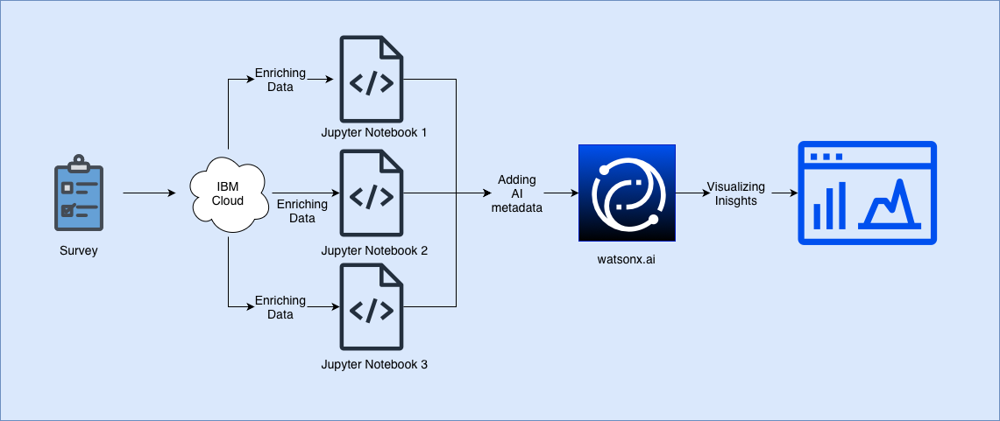

# Pilot-Template
## Executive Summary
Provide a high-level overview of the pilot. Summarize the purpose, scope, and intended outcome in a few sentences. This section should give readers a quick understanding of what the pilot is about without needing to read the full document.

## Problem Statement
Clearly define the problem or challenge that the pilot is trying to solve. Explain why this issue matters, who is affected, and what the current gaps or limitations are. Be specific enough so stakeholders can understand the context.

## Business Value
Describe the potential impact and benefits of solving the problem. Highlight how the pilot contributes to organizational goals, improves efficiency, reduces costs, enhances customer experience, or delivers measurable value.

## Architecture
Provide an overview of the architecture used to make this solution. Diagrams are always easier to read and also follow through with an explanation. Everything should be labeled and in termonology that both parties understand. It should be at the technical level of your audience.

`Example Architecture:`

## Technologies
List the expected IBM products and external technologies used in the solution. Also mention their outputs, any deliverables, and all artifacts from the pilot. These could be prototypes, reports, integrations, workflows, or any other tangible outcomes that will demonstrate progress or success.

## Data Dictionary
Provide a instructions for using this template. Explain the different components of the data. Make sure columns and important features are easily understood.

[Data Dictionary Section](./data/data-dictionary.md)

## Getting Started
Provide setup instructions for using this template. Outline the steps teams should follow (e.g., forking/cloning the repo, replacing placeholders, and customizing sections) so they can get started quickly and consistently.

[Getting Started](./getting-started.md)

## Resources
Additional materials that expand on the use case or supplement the pilot documentation. This may include links to SharePoint sites, ISC documentation, previous pilot results, workshop murals, training materials, reference implementations, or related research. Use this section to provide context and background information that supports understanding and execution of the pilot.

## Authors
Identify the people responsible for creating or maintaining the pilot. Include names, roles, and contact information (if appropriate), so others know who to reach out to for questions or collaboration.