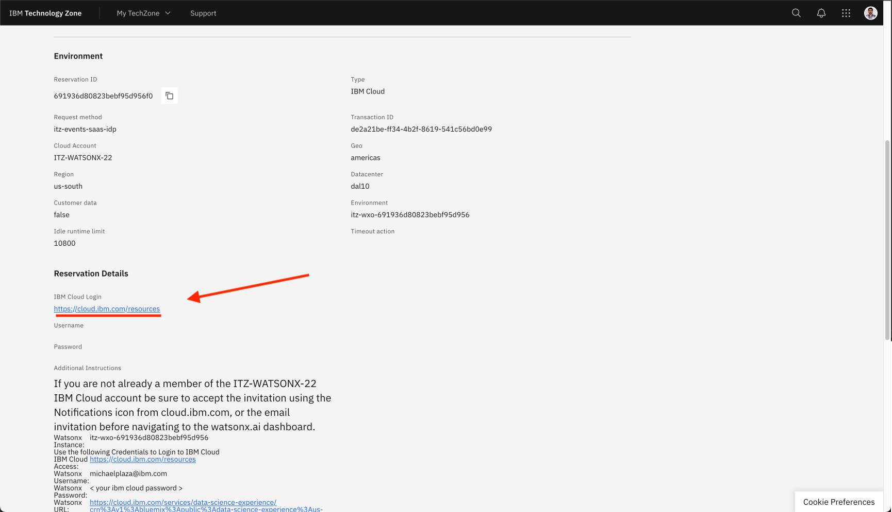
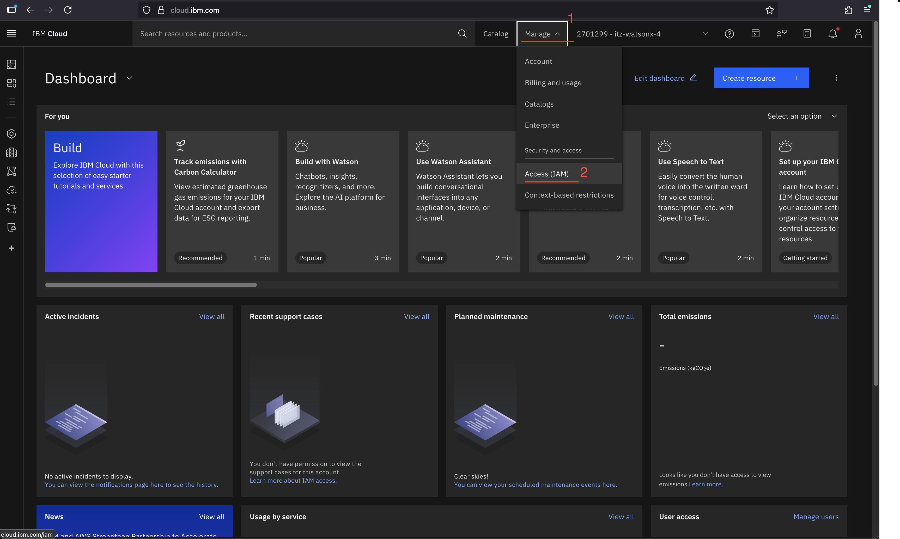
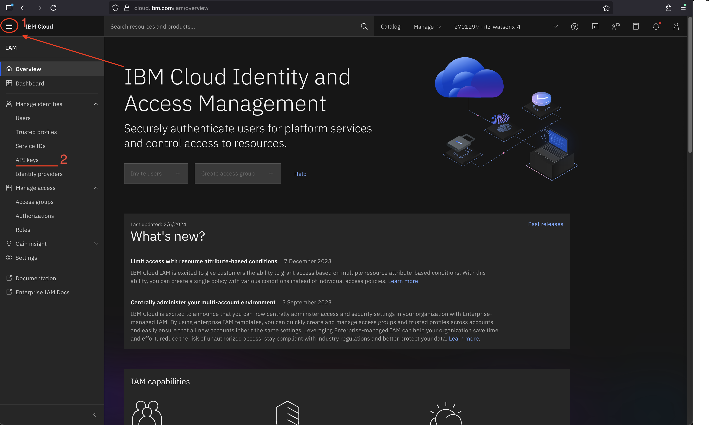
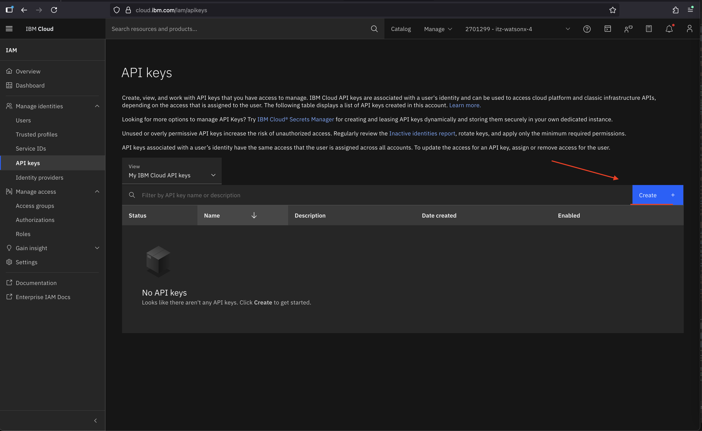
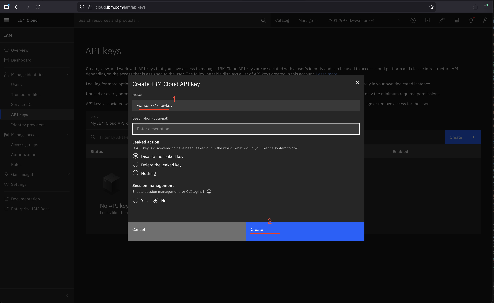
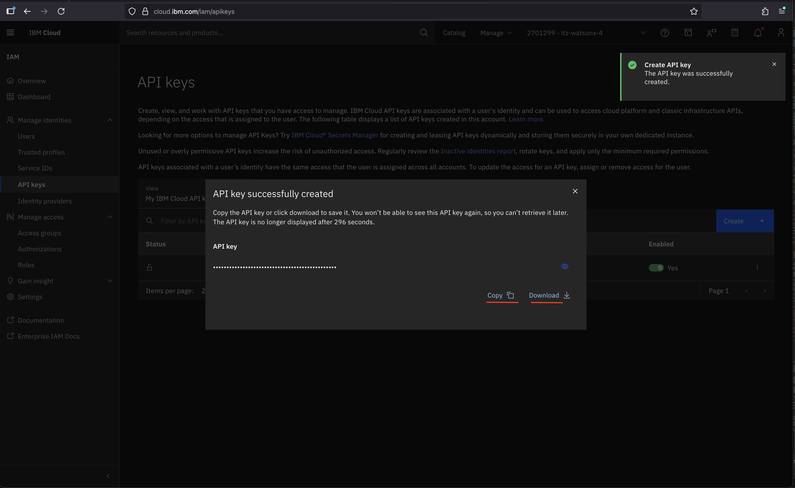

# Getting IBM Cloud IAM API Key
### 1. Navigate to IBM Cloud
#### Here: [https://cloud.ibm.com/resources](https://cloud.ibm.com/resources)

### 2. Click on the **Manage** tab and then **Access (IAM)**

### 3. Click on the **Hamburger** Button and then **API Keys**

### 4. Click on the **Create** Button

### 5. Give it a Name (I usually name it based on the instance and or project), and then click the **Create** Button

### 6. **Copy** the API Key and **Download** to keep track of, you will be putting this into your [.env](./.env)

