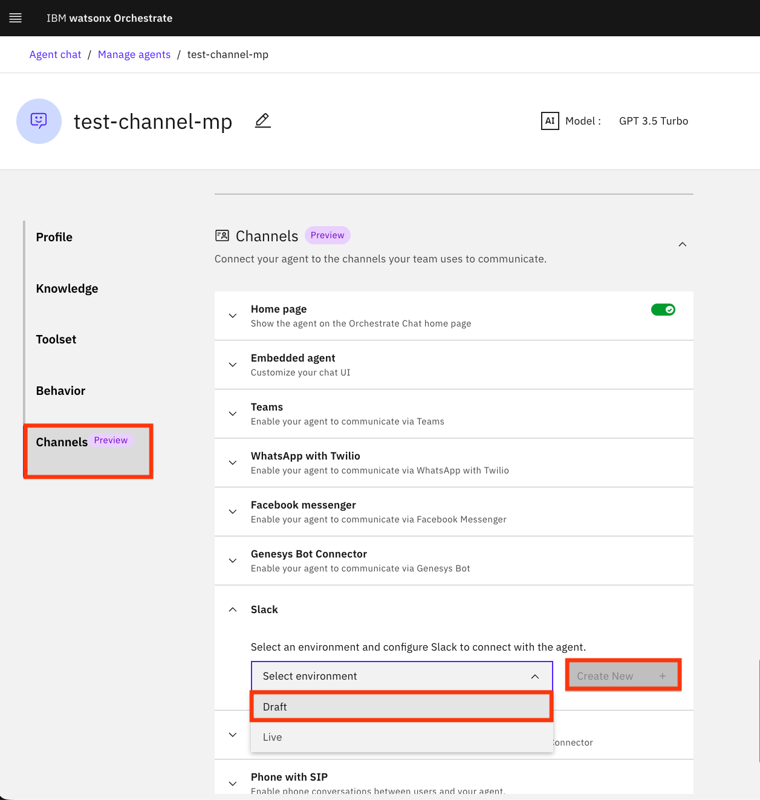

## PART I: Building a purchase agent to help users submit requests for new software
To kickoff the lab, we want to build an agent that can help us handle purchase requests. Imagine a user wants to purchase some new software but there are criteria we want to check on to reduce unneccessary approvals.  

In this section, we will build an agent that uses an agentic workflow tool and a 3rd party tool to help users fill out a form for a simple software request and submit a ServiceNow ticket request if criteria is met.  

### Build our purchase_agent the UI  
Click on the `hamburger` icon in the top left, then `Build`, then `Create agent +`, then `Create from scratch`, and enter the following  
Name: 
```
purchase_agent
```  
Description: 
```
This agent will be used to help answer inquiries related to submitting a request for new purchase of software.
```  
Once you are done, click into `Behavior` and paste the following

```
==========================================================
  SYSTEM PROMPT — SOFTWARE PURCHASE VALIDATOR
  ==========================================================
  GREETING BEHAVIOUR
  - If the user says “hi” or “hello”, respond with:
    "Hello, I am here to help you validate your software request." 

  GLOBAL RULES (STRICT)
  - Always acknowledge the user politely
  - Ask ONE question at a time
  - Always use American English

STEP 1: invoke the `sw_validator_workflow`
STEP 2: upon completion, return to user "Complete!"
```  

### ServiceNow Agent setup
Now that we have our basic agent blueprint mapped out, we can begin by adding the additional tools and catalog agents we will need to use it successfully.

Go back to the `hamburger` icon in the top left, then `Build`, then `Create agent +`, then `Start with a template` tab.  


Follow the below steps to add in our ServiceNow agent that we can use in collaboration to help the management of tickets


Search for ServiceNow in the search bar and scroll down to the Ticket Manager Agent  


  

Click on the Ticket Manager Agent and then click on Use as Template. These agents are ready to use agents that can also serve as templates if you need specific functionality within your connections, apps etc. For the purpose of this lab, we will not be editing this agent at all, however depending on your use case you can edit every single detail within this agent.


Scroll down to Toolset. Click on the three dots next to the `Create a ticket in ServiceNow` tool and then Edit details

  

Choose the `Connectors` option and click on the pencil to edit.  

  

Choose `Oauth2 Authorization Code`


Fill out the following information and select on the `Team credentials` option, then click Save changes  

Server URL: 
```
https://dev212075.service-now.com/
```  
Token URL: 
```
https://dev212075.service-now.com/oauth_token.do
```
Authorization URL: 
```
https://dev212075.service-now.com/oauth_auth.do
```  
Client ID: 
```
eb11f37583d44017b2a38a3b00595e5b
```  
CLient Secret: 
```
5v9Qg1Y(5k8rX.QcOPE0]5Rr.8N-AUC
```  

Once you saved them, re-open the connection details by clicking on the pencil. From here, select the Live option and click Paste draft configuration.  
Make sure `Team credentials` is selected for the Credential Type.  

After the you try to connect, you have to log in with the following creadentials and authorize:

username: 
```
admin
```  
password: 
```
GZ%*8cmWmdB3
```  

### Building our agentic workflow 
Click on the `hamburger` icon in the top left, then `Build`, then click into `All tools`, then click `Create tool +`, and then `Agentic workflow`
Add `sw_validator_workflow` as the Name and click `Start Building`  

  

We will be implementing a basic workflow where we ask a user the price and number of licenses needed.  
If the price is less than 0 (not possible) or greater than or equal to 10000 (too expensive), we cannot continue.  
If we are able to meet the price condition, we will ask a second question about how many licenses are needed.  
If we need greater than 0 and less than or equal to 1000 licenses, we can successfully continue and be prompted with a ServiceNow ticket to complete regarding this request.  

#### **Step 1**. Let's begin our workflow by including a welcome message.

Click on the `Add +` button, then under User Actvities, hover over `Present to user` and select `Message`  
Now click on the the green `Message 1` box and click on the pencil to rename the message box. Paste the following in the output message 
Output message: `Welcome! Let's validate this request!`  

  

#### **Step 2**. Now, click on the `+` sign between the `welcome` and `End` button. 

This time, we will begin with our first question so hover over `Collect from user` and click `Number` since we will be asking for price.
Click on the pencil icon and rename the name to `What is the USD cost for this software?`

Here's what our workflow should look like right now.  

  

#### **Step 3**. Now we are going to track the value of the user response in a variable using a logic block so we can use this later on. 

Similar to the steps above, click the `+` button under the `What is the USD cost for this software?` block. 
Hover over `Add a flow activity` and click `Logic block`  
You will then click on the code editor and can delete all of the pre-existing code.
Paste `flow.private.cost = flow["User activity 1"]["What is the USD cost for this software?"].output.value`

  

#### **Step 4**. Next, we will add a branch where we can actually evaluate the user input using our variable above.

Similar to the steps above, click the `+` button under the `Logic Block 1` block.  
Hover over `Add a flow control` and click `Branch`  
Click into the `Branch 1` object and under the if else Path conditions, click `Edit condition`
Click the `+` sign next to If and click the question under `User activity 1`

  

Now click, if value >= 0, click out, and then click `Add condition +` and repeat the same but with value < 10000.  


Feel free to rename **Path 1** and **Path 2** in the Branch by clicking the names directly to `Cost satisfied` and `Cost criteria not` 
You will now see 2 different paths, based on the outcome from the above.  

#### **Step 5**. Click on the green `Add +` button and follow the steps we used in step 1 


This time, use output message: `Cost is invalid or too expensive! Criteria is not met.` and title `Cost not met`
Essentially, if the cost is too expensive or invalid, the user is presented this message and the flow ends. 

#### **Step 6**. Under Branch 1, click the `+` button and add a follow up question. This is the case where the price critiera was met so we can continue evaluating if this request is permissible. 

Click `+`, hover over `Collect from user` and click `Number` since we will be asking for number of licenses.
Follow the steps in step 2 but instead use rename the block to `How many licenses are needed?`  

#### **Step 7**. Now, we will similarly track the variable value like we did for cost, so follow the step 3


You can also delete everything in the default code editor and just have this:
`flow.private.num_licenses = flow["User activity 1"]["How many licenses are needed?"].output.value`  

#### **Step 8**. Now that we have a logic block, we will add another branch based on how many licenses are needed.  

If we need 1-1000 licenses (inclusive), then criteria is met. Otherwise, we cannot continue. 
Follow Step 4, but use value > 0 and value < 1000 instead. Here's what your branch block should include.  


#### **Step 9**. We will follow Step 5, but instead create a criteria not met display message for our number of licenses question.

Follow Step 5 but use title: `Licenses not met` and Output message: `The number of licenses is either invalid or too many! Criteria is not met.`  


#### **Step 10**. Let's add a display message under the path where the criteria for number of licenses was met. 

Follow steps 5/9 above for how we would build a display message but use title: `Criteria met` and output message: `Criteria met! We will now fill out a ServiceNow Ticket.` 

  

#### **Step 11**. The last step in completing our workflow is now adding in our ServiceNow tool. 

Under the `Criteria met` box, let's add a tool call. We can do this by click `+`, `Call a tool`, and select `Create a ticket in ServiceNow`.  Click the `Done` button in the top right 


Here's what our final workflow should look like.  


## PART II: Building a document agent analyst to handle all document inquiries

Suppose, you have different vendor documents and need ...
In this section, we will build an agent that will use documents as a knowledge base to answer relevant questions...


### watsonx Orchestrate ADK

As mentioned above, the ADK allows hosting the core Orchestrate components on a developer laptop. For the lab, you will run the ADK on your own laptop. 

#### Local machine

To run it on your own laptop, you need to install:
- Python 3.11 + 

For initial setup, we recommend the following steps, but if you want to use a different virtual environment manager please refer to the steps here: [the ADK install page](https://developer.watson-orchestrate.ibm.com/getting_started/installing)
These steps will help install the ADK, add & activate your environment, and begin building! 


Once you're environment is activated, you can confirm this by entering

```bash
orchestrate agents list
```

... something about you should see some agents from earlier part ...


Navigate to your repository and to the  `~/wx-orchestrate/agents` directory. you should see a YAML file called `document_agent.yaml`
This file is the blueprint for our agent and we will use the ADK to import this into our environment. 


Run the following command to import this agent into the environment: 
```bash
orchestrate agents import -f document_agent.yaml
```
You should see the following message


### Modify agent in the UI
Go back into your orchestrate instance, refresh and your `document_agent` should be there. Click into it, and scroll down to the `Knowledge` portion. Click `Add source +`, then `New knowledge`, `Upload files`, and attach the five provided documents that you have downloaded. 

Each of these are different contractual agreements between a vendor and client, laying out all expectations requirements, and agreed-upon goals. Each of these five files have different formatting, structure, and amount of information that represents inherent differences in contract structure. 

Insert the following prompts one-by-one and see how we can answer questions about our five documents.

#### Prompt 1. 
```
Does CloudTech Solutions Inc retain any right in having Global Manufacturing Corporation's data outside of providing required services?
```
#### Prompt 2. 
```
Within how many days should the licensor DataVault deliver the software to the licensee Regional Health Care and it what forms can it be delivered?
```  
#### Prompt 3
```
For the agreed upon management of servers, if the average server CPU utilization is 75%, is this permissible?
```  
#### Prompt 4
```
Tell me the risk management strategy outlined for the on-prem to AWS migration.
```
#### Prompt 5
```
From the Enterprise Solutions Group vendor point of view, if the customer ask for support on their McAfee security software, is it okay for us to put resources towards this?
```  
#### Prompt 6
```
Compare and contrast the payment structures across all five contracts. Which agreement has the least risk in exceeding a total cost of $2 million?
```
#### Prompt 7
```
Give me a list of all assets/supported technologies in the software maintenance and perpetual license agreements.
```

Now try a completely irrelevant prompt: `
#### Prompt 8
```
What is the capital of France?
```  

you should see that we get a return message 

```
This is out of scope.
```
If you scroll to the Behavior, you should see a Guideline set in place, which is a rule we have to make sure our agent is focusing on just document-related inquiries. 

### Enhancing our agent with an MCP tool
Currently, our agent is able to answer questions pertaining to each of the five documents and perform some analysis like we've just done so far. While our agent is functional, it is currently limited to our five documents.  

A user may be interested in industry-wide standards, pricing, compliance, or information that can be relevant in analyzing these documents.  
We can broaden our agent and give it the capability for searching the web through an `MCP Server`

An `MCP Server` is a lightweight program following MCP, an open-protocol created by Anthropic to standardize how AI agents can connect to external data sources and tools. Think of it as an USB flash drive for an AI assistant where different MCP servers contain access to different resources and we can use a flash drive to get access to such resources.

We are going to setup an MCP server and specifically using a searchweb tool so our agent can browse the internet when relevant.  

Scroll to the `Toolset` section and click `Add tool +`.  


Insert the following:

**Server Name**: 
```
websearch_mcp
```  
**Install Command**: 
```bash
npx -y @guhcostan/web-search-mcp
```  

Once you add the MCP server you should see a tool for `websearch_mcp:search_web`. Select and click on it to add it to the agent. 

Before we begin using it, let's make sure our agent instructions contain behavior for when we need to use this tool. Go to the `Behavior` section and add the following to the instructions:  

```
If a user asks about any of the vendors, clients or project topics that span beyond just the documents such as industry-wide standards, compliance, financial analysis, and competitive analysis, use the `websearch_mcp:search_web` tool to fulfill the request. 
```

Now, we can refresh and should be able to begin asking questions. Insert the following prompts one-by-one and see how we can use our tool.

#### Prompt 1
```
Give me some reviews on CloudFirst Consulting Partners Inc?
```

#### Prompt 2
```
Can you tell me the Oracle database licensing cost per core?
```

#### Prompt 3
```
What is considered industry-wide network latency acceptable thresholds in cloud computing?
```

Great! Now, we have been able to enhance our agent and use it to not just analyze documents, but also help users ask useful, relevant questions in analyzing vendor contracts. 


## PART III: Building A User Agent to confirm credit card requirements

In this section, we will build a user agent that can confirm if the user has a credit card on file and if the credit card is active and can be used by systems. We will use a plug-in guardrail to ensure at no point the entire credit card number is leaked to the agent.

### Orchestrate Plugins
Watson Orchestrate plug-ins play a role in enhancing the capabilities and robustness of agents. They help enable custom behavior to be easily added to an agent’s processing flow, allowing modifications to incoming input or outgoing output. This customization is essential for applications where agents must comply with safety, security, and regulatory requirements. Plug-ins protect the agent from problematic inputs by filtering or sanitizing content and enforce compliance by applying guardrails to sensitive or restricted information. 
> For this lab we would be tackling pre and post invoke issue with sensitive information like credit card numbers. 
> Also, for this section of the lab we would be be using the ADK to deploy everything and then verify the agent on the Watson Orchestrate UI.

#### Import Credit Card Check Plugin
```bash
orchestrate tools import -k python -f credit_card_masking_plugin.py
```

- This plugin will mask the credit card number in the agent response and user query and also mention the safety measure by prompting the user to not share the credit card number.Got through the credit_card_masking_plugin.py to understand how the masking function is used for ensuring secure messages.

#### Import User Tools
```bash
orchestrate tools import -k python -f customer_query_tool_package/customer_query_tool.py -p customer_query_tool_package
```

- This tool file will help the agent interact with an sqlite database to check if the user has a credit card on file and if the credit card is active and can be used by systems. This will upload three tools 
    - `get_customer_info` - Query customer by ID or name
    - `list_all_customers` - List all customers in database
    - `get_customer_credit_card` - Get credit card info for a customer

- When tools are deployed to Watson Orchestrate, they run in isolated containerized environments. Hence we can deploy all the dependencies in the tools folder and add the package to the tool deployment on the ADK (the approach we used here to ensure the db is accessible to the tool) If you have specific package requirements, you would also add the requirements.txt to this folder - customer_query_tool_package


#### Verify tools imports
```bash
orchestrate tools list
```

#### Create agent
```bash
orchestrate agents create -f user_agent.yaml
```

- This will create a user agent that can confirm if the user has a credit card on file and if the credit card is active and can be used by systems. Some sample prompts:

#### Prompt 1
```
Do I have an active credit card on file? My Name is Vaisakhi Mishra
```

#### Prompt 2
```
Do I have an active credit card on file? My Name is John Smith
```

#### Prompt 3
```
Is my credit card 3782-3456-7890-1234 still active?
```

#### Prompt 4
```
Is my credit card 4532-1234-5678-9010 on file?
```

#### Prompt 5
```
When does my credit card 4532123456789010 expire?
```
  

#### Verify deployment
```bash
orchestrate agents list
```

## PART IV: Connecting to Different Interfaces and LLMs
While we have built powerful agents in the UI and via the ADK, agents are most effective when they live where your users are.
In this final section, we will bridge the gap between platforms by connecting our agents to Slack for real-time chat and swapping the underlying "brain" of our agent to use an OpenAI LLM.

### Connecting to Slack
This bridge allows your agent to participate in conversations and respond to user queries directly within your workspace. Allowing your agent to meet potential users where they do work with a few steps.
> more resources on this setup here: https://www.ibm.com/docs/en/watsonx/watson-orchestrate/base?topic=channels-connecting-slack

First, navigate to the agent you want to use in Slack and click on `Channels` on the left-hand side. Select `Slack`, set the environment to `Draft`, and click `Create New`.
  

Next, follow the steps provided in the UI to configure the Slack Interface. 
> Once done, you will have to navigate to that workspace in slack and then @ the bot's name, it should be able to answer your questions after joining the channel.

### Connecting to OpenAI LLMs
Now you can add external models to watsonx Orchestrate to support any existing providers (including both large and small models). To do so, use a model.yaml file and the commands below: 
> more resources here: https://developer.watson-orchestrate.ibm.com/llm/managing_llm

Initialize your environment and set up the secure credential store
```bash
orchestrate connections add -a openai_credentials
orchestrate connections configure -a openai_credentials --env draft -k key_value -t team
orchestrate connections set-credentials -a openai_credentials --env draft -e "api_key="
```

Import the model specification to the AI Gateway
```bash
orchestrate models import --file ./models/gpt-model.yaml --app-id openai_credentials
```

Now you can view the models in watsonx Orchestrate with:
```bash
orchestrate models list
```
> imported models start with `virtual-model`

Once the model is imported, you will update your agent's configuration to use this new LLM. This allows you to control whether you are using large reasoning models or small, faster models. Allowing you to fit the right model for your specific use case.

Feel free to test this out, a sample agent yaml would be [here](./wx-orchestrate/agents/sample-openai-agent.yaml), all you would need to do is update the yaml file you want to test with to point towards the udpated model and re-import the agent.