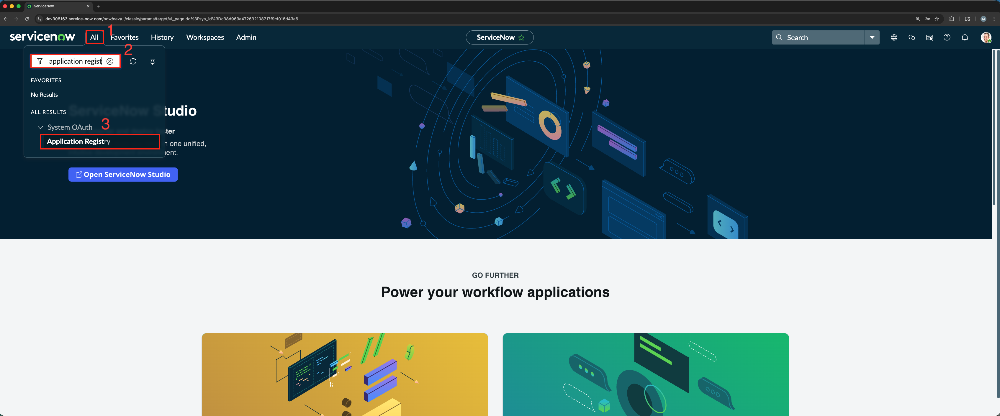
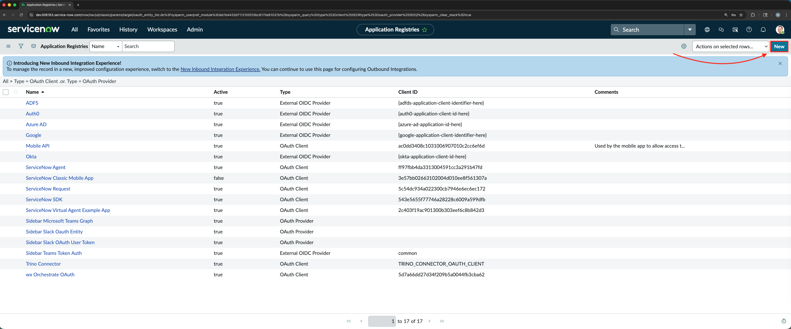
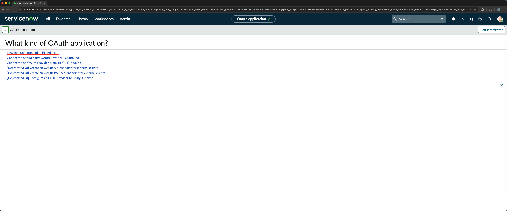
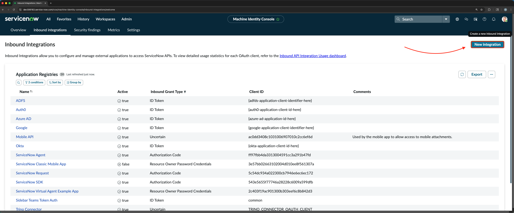
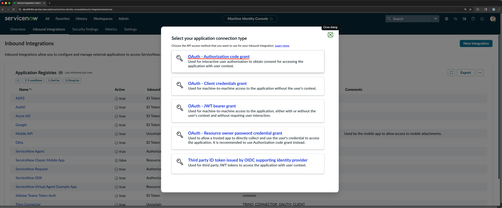
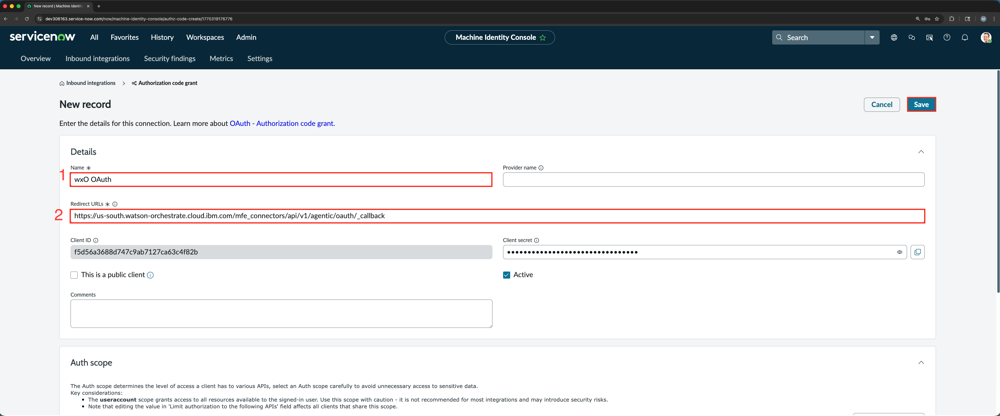
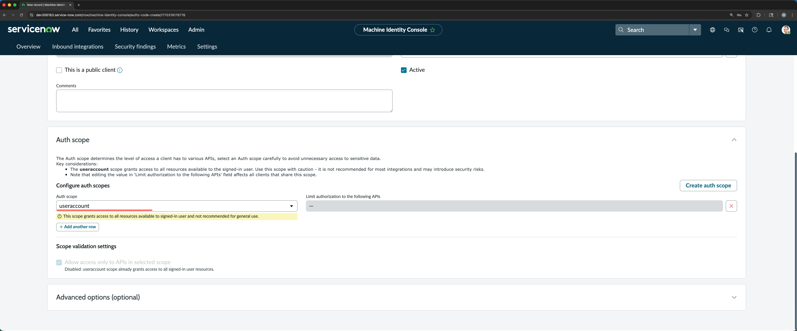

# ServiceNow OAuth Integration Setup

A step-by-step guide to configure OAuth Authorization Code Grant in ServiceNow.

## 0. Step 0 Set up for Lab

To get a ServiceNow instance for the lab, you can use the [ServiceNow Developer Site](https://developer.servicenow.com) to request a trial instance (time varies, but usually takes 30 minutes to 3-4 days to be approved).

## 1. Login to ServiceNow

Navigate to your ServiceNow instance and login with your credentials.
> Hopefully you received an email with your instance url `https://dev<your-instance>.service-now.com`. If not you can navigate through [their developer site](https://developer.servicenow.com/), by signing in and clicking `manage my instance`.

## 2. Navigate to Application Registry

Under All search for "application registry" in the filter navigator and select **Application Registry**.

## 3. Create a New Application

Click **New** to create a new record in the application registry.

## 4. Select Application Type

Choose the **New Inbound Integration Experience** as the type of OAuth application you want to create.

## 5. Create a New Integration

Click **New Integration**.

## 6. Select Connection Type

Choose **OAuth - Authorization code grant** from the connection type options.

## 7. Configure OAuth Details

Fill in the required fields:

- **Name**: Your application name
- **Redirect URL**: `https://us-south.watson-orchestrate.cloud.ibm.com/mfe_connectors/api/v1/agentic/oauth/_callback`
- **Client ID**: Auto-generated (copy this before leaving)
- **Client secret**: Auto-generated (copy this before leaving)
- **Active**: Check to enable

Select the **useraccount** Auth scope.

Then click **Save** to create your OAuth integration.

---

**Important**: Copy and securely store your Client ID and Client Secret immediately after creation.